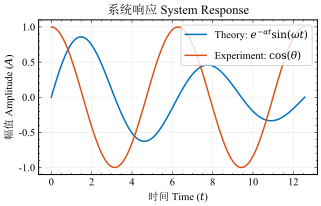
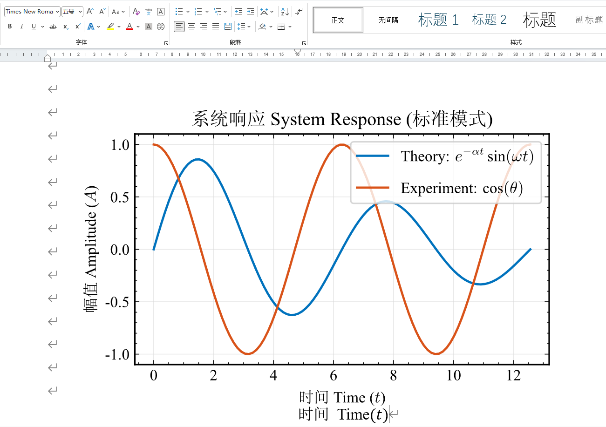

# XiDianPlots

**XiDianPlots** 是一个专为西安电子科技大学（Xidian University）硕士/博士学位论文设计的 Matplotlib 绘图样式库。

### 主要特性

* **开箱即用**：自动下载并配置所需的 `RomanSong`（宋体+Times New Roman）字体。
* **论文合规**：预设 5 号字（10.5pt），A4 版面适配（宽 5 英寸），宋体/Times New Roman 混排。
* **PGF后端配置**：使用后 `pgf`后端调用 xelatex 渲染，完美支持数学公式与中文混排，用于出图。

---

## 安装

### 方式 1：pip

**安装**

```sh
pip install git+https://github.com/Huffer342-WSH/XiDianPlots.git
```

**更新**
```sh
pip install --upgrade --no-cache-dir git+https://github.com/Huffer342-WSH/XiDianPlots.git
```

### 方式 2：git clone + pip

```bash
git clone https://github.com/Huffer342-WSH/XiDianPlots.git
cd XiDianPlots
pip install .
```

> 注意：安装过程中会自动从 CDN 下载字体文件[Font_RomanSong.ttf@AaaGss](https://github.com/AaaGss/Font_RomanSong/raw/refs/heads/main/RomanSong.ttf)（约 10MB），请保持网络连接

---

## 使用

```python
import matplotlib.pyplot as plt
import numpy as np
import XiDianPlots

# 准备数据
x = np.linspace(0, 4 * np.pi, 100)
y1 = np.sin(x) * np.exp(-0.1 * x)
y2 = np.cos(x)

with plt.style.context(["xidian", "grid"]):
    fig, ax = plt.subplots()

    ax.plot(x, y1, label=r"Theory: $e^{-\alpha t} \sin(\omega t)$")
    ax.plot(x, y2, label=r"Experiment: $\cos(\theta)$")

    ax.set_xlabel(r"时间 Time ($t$)")
    ax.set_ylabel(r"幅值 Amplitude ($A$)")
    ax.set_title(r"系统响应 System Response")
    ax.legend(loc="upper right")

    # 默认后端
    fig.savefig("demo_standard.png", dpi=600)
    print("[Success] demo_standard.png 已生成")

    fig.savefig("demo_standard.svg")
    print("[Success] demo_standard.svg 已生成")

    fig.savefig("demo_standard.pdf")
    print("[Success] demo_standard.pdf 已生成")

    # 使用pgf后端，调用xelatex生成图片
    fig.savefig("demo_latex.png", dpi=600, backend="pgf")
    print("[Success] demo_latex.png 已生成")

    fig.savefig("demo_latex.pdf", backend="pgf")
    print("[Success] demo_latex.pdf 已生成")

    # pgf不能导出svg图片，使用pdf中转
    XiDianPlots.savefig(fig, "demo_latex.svg", backend="pgf")
    print("[Success] demo_latex.svg 已生成")

    plt.show()
```

**在 LaTeX 论文中插入生成的 PDF**:

```latex
\begin{figure}[htbp]
    \centering
    \includegraphics{paper_figure.pdf}
    \caption{这是通过 XiDianPlots 生成的矢量图}
\end{figure}
```

**word可以使用svg格式的图片**

---

## 示例

[examples/examples.py](./examples/examples.py) 生成的图片在[examples/figure](./examples/figure)，例如：



在word中粘贴svg效果如下




---

## ❓ 常见问题 (FAQ)

**Q: RomanSong.ttf字体的用处？**

**A:** matplotlib默认后端在渲染时只会选择一个字体，所以使用了一个拼接过的字体。pgf模式下没有这种问题

**Q: `fig.savefig()` 显示的图片很小？**

**A:** 为了防止预览的时候窗口很大，默认DPI为 96。save的时候手动设置dpi：

```python
fig.savefig("figure.png", dpi=300)
```

---

## 开发

###  初始化

 ```sh
 uv sync
 ```
